# 김형섭
Github : https://github.com/pm-10 
Blog : https://blog.gibsonkim.dev/

# 경력
[쏘카 말레이시아](https://www.socar.my/)
Core app developer ( Team Leader )
- 2018/07 ~ 현재 재직중

[쏘카](https://www.socar.kr/)
Software Engineer
- 2017/11 ~ 현재 재직중

[피알앤디컴퍼니](https://www.prnd.co.kr/)
Android Developer
- 2015/08 ~ 2017/09

[AFIDEV](http://www.afidev.com/)
Android Developer
- 2015/02 ~ 2015/08

로체인
Android Developer
- 2014/10 ~ 2015/01

# 기타 이력

[CADI](http://cafe.naver.com/teamcadi)
- 대학생 IT연합 동아리 멘토링, 안드로이드 강의

# 프로젝트

### 쏘카 말레이시아 코어 앱서비스
- 소속 : 쏘카 말레이시아
- 역할 : 쏘카 말레이시아 코어 앱서비스 팀 리드 및 팀 빌딩
- 기간 : 2018/07 ~ 2019/10
- 사용기술 : React Native, Node.js, Ext.js, docker, code push, serverless framework ...

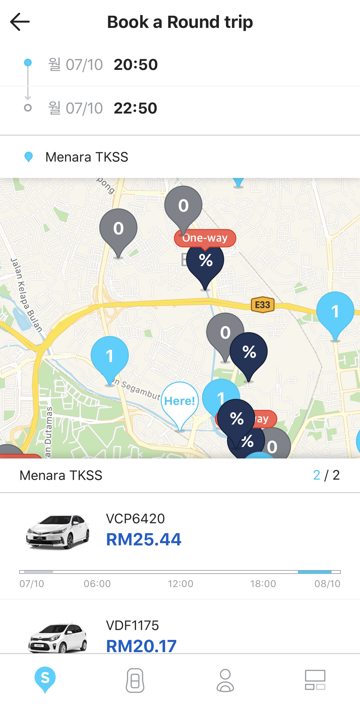  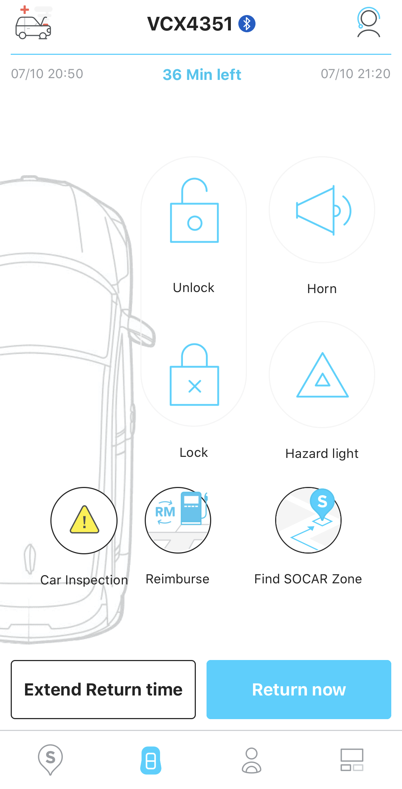  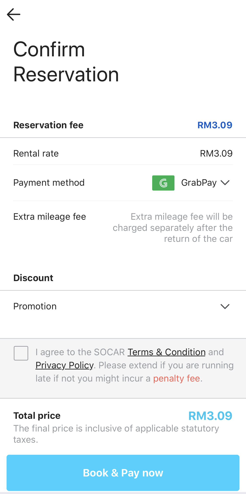

### 쏘카 글로벌 프로젝트
- 소속 : 쏘카
- 역할 : 쏘카 말레이시아 현지 서비스 개발
- 기간 : 2018/03 ~ 2018/07
- 사용기술 : React Native, Node.js, Ext.js ...

### 쏘카 백오피스 개발
- 소속 : 쏘카
- 역할 : 백오피스 프론트엔드 개발
- 기간 : 2017/11 ~ 2018/03
- 사용기술 : laravel, JQuery, Ajax ...

### 관광가이드앱
- 소속 : 쏘카
- 역할 : 쏘카 차량 디바이스용 안드로이드 앱 개발 (1인개발)
- 기간 : 2017/11 ~ 2018/01
- 사용기술 : Kotlin, Android, Realm ...

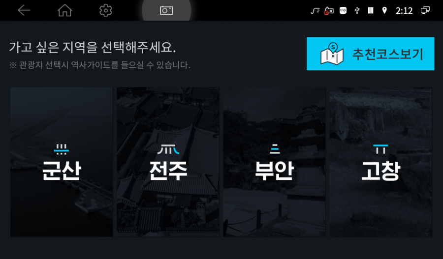 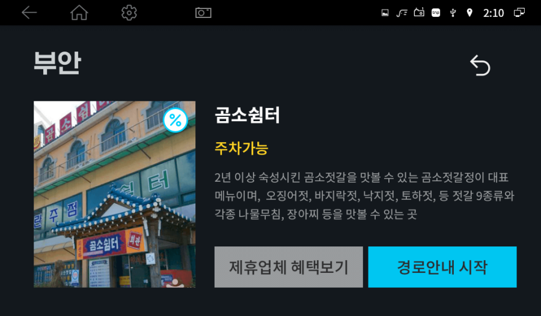
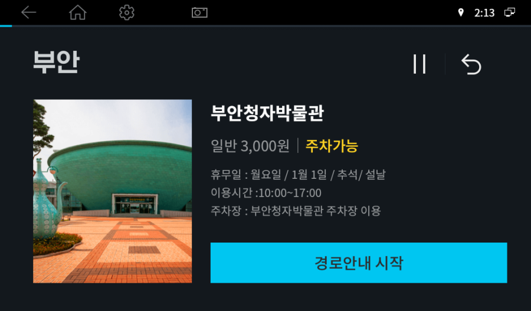 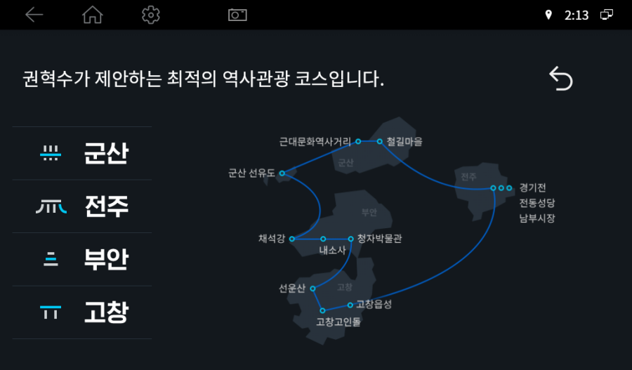

### 헤이딜러
- 소속 : 피알앤디컴퍼니
- 역할 : 안드로이드 앱 개발 (1인개발)
- 기간 : 2015/08 ~ 2017/09
- 사용기술 : Java, Android, RxJava, Lambda, DataBinding, UI Test ...
- PlayStore (https://play.google.com/store/apps/details?id=kr.perfectree.heydealer)

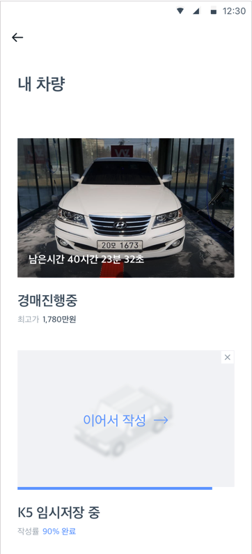 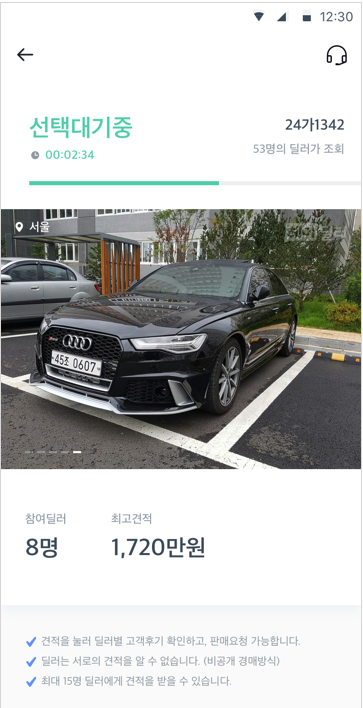  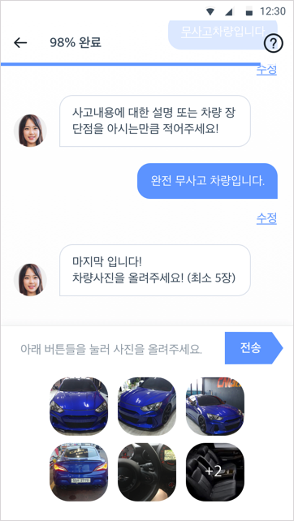 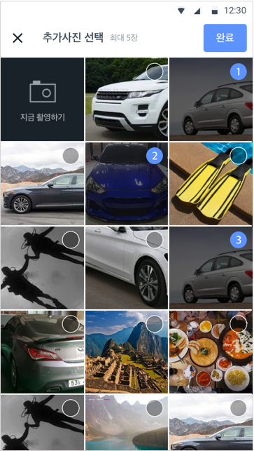

### 헤이딜러(딜러용)
- 소속 : 피알앤디컴퍼니
- 역할 : 안드로이드 앱 개발 (1인개발)
- 기간 : 2015/08 ~ 현재
- 사용기술 : Java, Android, RxJava, Lambda, DataBinding, UI Test, Firebase(DataBase) ...
- PlayStore (https://play.google.com/store/apps/details?id=kr.perfectree.heydealerfordealer)

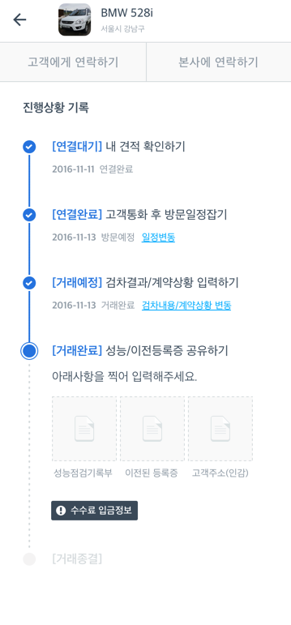 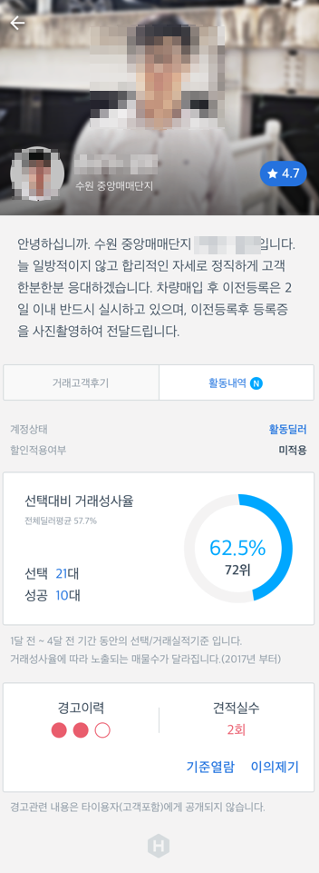  

### 카큐™
정책상으로 핵심기능 비활성상태

- 소속 : 피알앤디컴퍼니
- 역할 : 안드로이드 앱 개발 (1인개발)
- 기간 : 2015/08 ~ 2016/06
- 사용기술 : Java, Android, Lambda ...
- PlayStore (https://play.google.com/store/apps/details?id=kr.carq.carq)

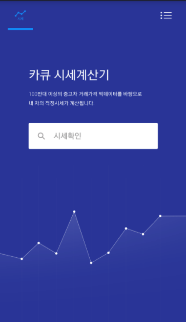 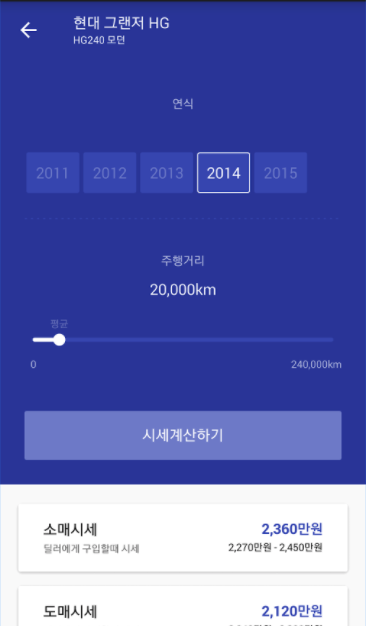 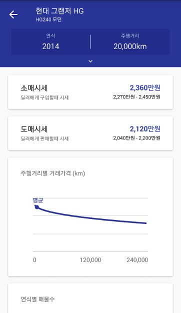 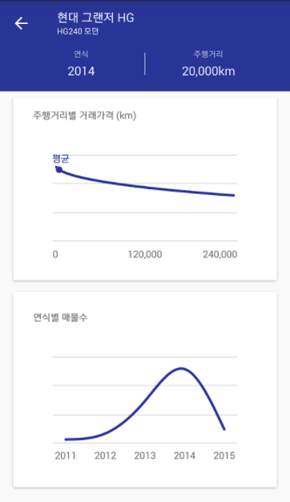

### 쏘캣

- 소속 : AFIDEV
- 역할 : 안드로이드 앱 유지보수
- 기간 : 2015/02 ~ 2015/08
- 사용기술 : Java, Android, Socket ...
- PlayStore (https://play.google.com/store/apps/details?id=com.afidev.SSOCAT)

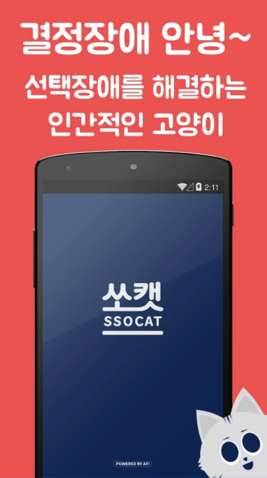 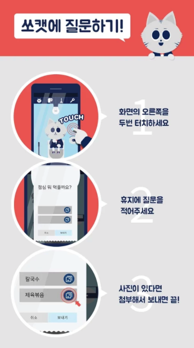 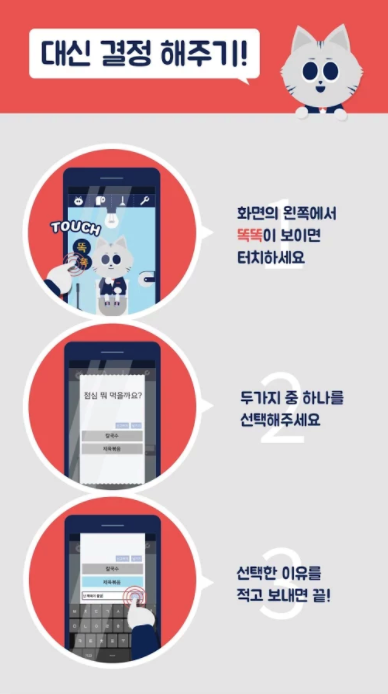 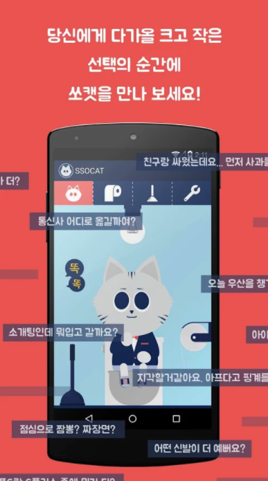

### 쩐알람
서비스종료

- 소속 : 로체인
- 역할 : 안드로이드 앱 개발
- 기간 : 2014/10 ~ 2015/01
- 사용기술 : Java, Android ...

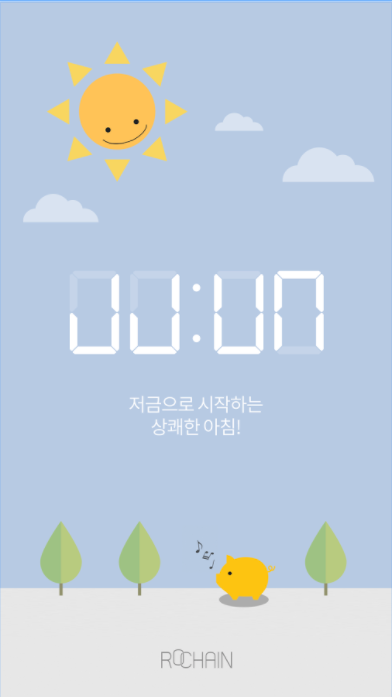
